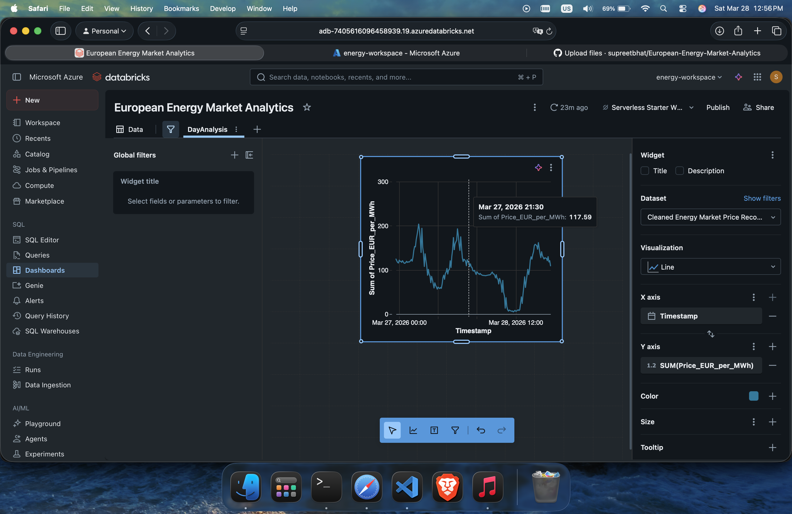

# ⚡ Automated ETL Pipeline: European Energy Market (ENTSO-E)

An automated, cloud-native Data Engineering pipeline that extracts Day-Ahead wholesale electricity prices from the European transmission grid, transforms complex interval-based XML data into a chronological time-series, and serves it through an interactive Databricks SQL Dashboard.

## 🎯 Project Overview
Wholesale electricity prices in the Germany/Luxembourg (DE-LU) bidding zone are highly volatile, frequently dropping below zero during peak renewable generation hours. To analyze these trends, this project establishes a reliable, automated ETL (Extract, Transform, Load) pipeline.

The core engineering challenge was handling the ENTSO-E API's nested XML response, which groups prices into 15-minute intervals (Position 1-96) rather than standard timestamps, and often includes overlapping duplicate auction data. This pipeline dynamically parses the XML, filters anomalies, and calculates exact chronological timestamps using PySpark time-delta operations.

## 🏗️ Architecture & Tech Stack
* **Language:** Python
* **Extraction:** `requests`, `xml.etree.ElementTree`, `datetime`
* **Transformation & Compute:** PySpark, Pandas, Azure Databricks (Serverless Compute)
* **Storage:** Databricks Unity Catalog (Columnar Parquet format)
* **Orchestration:** Databricks Workflows (Scheduled Cron Job)
* **Visualization:** Databricks SQL Dashboards

## ⚙️ Pipeline Execution Flow

### 1. Extract (API Integration)
A Python script connects to the ENTSO-E Transparency Platform REST API using a secure authorization token. It requests the trailing 24 hours of Day-Ahead pricing data for the DE-LU zone. The raw, nested XML payload is ingested directly into an Azure Databricks Unity Catalog Volume (`/raw_data/`).

### 2. Transform (PySpark & Time-Series Math)
The pipeline reads the raw XML from the cloud volume and performs the following transformations:
* **Namespace Cleaning:** Strips complex XML namespaces for standard parsing.
* **Duplicate Filtering:** Isolates the primary 15-minute auction data by filtering out secondary/overlapping local auction blocks.
* **Chronological Calculation:** Extracts the block `<start>` time and iteratively adds 15-minute `timedelta` increments based on the specific `<position>` tag to generate a true, continuous `Timestamp`.
* **Data Type Casting:** Converts string outputs into strict float arrays for pricing.

### 3. Load & Orchestrate
The clean dataset is converted into a highly optimized PySpark DataFrame and written back to the Unity Catalog as a compressed `Parquet` file. The entire process is containerized within a Databricks Workflow, scheduled to run automatically every night at 02:00 AM.

### 4. Visualize
A Databricks SQL Dashboard queries the Parquet file to visualize the 15-minute market fluctuations, highlighting the evening demand spikes and midday renewable energy price drops.

## 📊 Dashboard Preview

*(Note: Replace the link above with the actual path to your screenshot once uploaded to the repo)*

## 📂 Repository Structure

* `src/pipeline.py` : The master Python script containing the Extraction and Transformation logic.
* `data/sample_output.csv` : A static 10-row sample of the final cleaned output for quick reference.
* `.gitignore` : Security configurations to prevent credential leaks.
* `README.md` : Project documentation and architectural overview.

## 🚀 Setup & Reproduction

To deploy this pipeline in your own environment:

1. **API Access:** Register on the ENTSO-E Transparency Platform and request a standard RESTful API security token.
2. **Cloud Environment:** Provision an Azure Databricks workspace and create a standard compute cluster.
3. **Storage Setup:** Create a new Unity Catalog Volume named `raw_data`.
4. **Execution:** Update the `API_KEY` and `Volume` paths in `src/fetch_energy_data.py` and run the script within a Databricks Notebook.
5. **Automation:** Attach the Notebook to a new Databricks Workflow and set a daily trigger schedule.

***
*Architected and developed by Supreet* 
